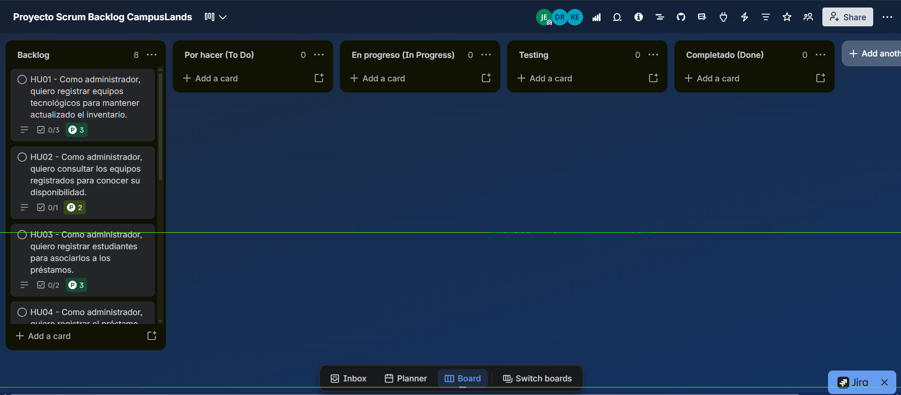

# PRODUCT BACKLOG DEL PROYECTO

**Sistema de Préstamo de Equipos Tecnológicos — MVP en Python**

---

## 1. Información General del Artefacto

- **Proyecto:** Sistema de Préstamo de Equipos Tecnológicos
- **Product Owner:** Juan David Esparza Castillo
- **Scrum Master:** Duban Camilo Bernal Rodríguez
- **Equipo de Desarrollo:** Karen Yaritza Escobar Pinto
- **Enlace al Tablero de Gestión (Trello):** (https://trello.com/b/pJxnmiJQ/proyecto-scrum-backlog-campuslands)
- **Ubicación de entrega:** `01_Product_Backlog/Product_Backlog.md`

---

## 2. Matriz Consolidada del Product Backlog

|    ID    | Historia de Usuario                              | Prioridad | Story Points | Sprint Asignado  |  Estado   |
| :------: | :----------------------------------------------- | :-------: | :----------: | :--------------: | :-------: |
| **HU01** | Registrar equipos tecnológicos en el inventario  |   Alta    |      3       |     Sprint 1     | Pendiente |
| **HU02** | Consultar inventario y disponibilidad de equipos |   Alta    |      2       |     Sprint 1     | Pendiente |
| **HU03** | Registrar estudiantes para vincular préstamos    |   Alta    |      3       |     Sprint 1     | Pendiente |
| **HU04** | Registrar préstamo de equipo a estudiante        |   Alta    |      5       |     Sprint 1     | Pendiente |
| **HU05** | Registrar devolución de equipo prestado          |   Alta    |      3       |     Sprint 1     | Pendiente |
| **HU06** | Consultar lista de equipos actualmente prestados |   Media   |      5       | Backlog / Futuro | Pendiente |
| **HU07** | Consultar historial general de préstamos         |   Media   |      5       | Backlog / Futuro | Pendiente |
| **HU08** | Eliminar equipo del inventario                   |   Baja    |      3       | Backlog / Futuro | Pendiente |

> **Nota sobre estimación:** Los _Story Points_ representan una medida relativa de esfuerzo, complejidad técnica, incertidumbre y riesgo acordada por el equipo durante el refinamiento y Sprint Planning; no equivalen a horas de trabajo.

---

## 3. Fichas Detalladas de Historias de Usuario

### HU01: Registro de Equipos Tecnológicos

- **Historia:** Como administrador, quiero registrar equipos tecnológicos para mantener actualizado el inventario institucional.
- **Prioridad:** Alta
- **Story Points:** 3
- **Criterios de Aceptación:**
  1. Debe solicitar obligatoriamente: código identificador, tipo (portátil, tablet, proyector, etc.), marca, modelo y estado.
  2. El código del equipo debe ser único en el sistema. Si ya existe, debe mostrar un mensaje de error y no permitir el duplicado.
  3. Al registrarse, el estado inicial por defecto debe ser `Disponible`.
  4. Los datos deben persistir de inmediato en el archivo `datos/equipos.json`.

---

### HU02: Consulta de Equipos y Disponibilidad

- **Historia:** Como administrador, quiero consultar los equipos registrados para conocer su disponibilidad actual.
- **Prioridad:** Alta
- **Story Points:** 2
- **Criterios de Aceptación:**
  1. Debe listar en consola todos los equipos almacenados en `datos/equipos.json`.
  2. La salida debe ser legible y formateada, mostrando: Código, Tipo, Marca, Modelo y Estado (`Disponible` / `Prestado`).
  3. Si no existen equipos registrados, el sistema debe informar: _"No hay equipos registrados en el inventario"_.

---

### HU03: Registro de Estudiantes

- **Historia:** Como administrador, quiero registrar estudiantes para asociarlos a los préstamos de equipos.
- **Prioridad:** Alta
- **Story Points:** 3
- **Criterios de Aceptación:**
  1. Debe solicitar obligatoriamente: documento de identidad, nombre completo, correo electrónico y programa académico.
  2. El documento de identidad debe ser único. Si el estudiante ya está registrado, debe alertar al usuario.
  3. Los campos de texto no deben permitirse vacíos.
  4. La información debe guardarse correctamente en `datos/estudiantes.json`.

---

### HU04: Registro de Préstamo de Equipo

- **Historia:** Como administrador, quiero registrar el préstamo de un equipo a un estudiante para controlar los recursos prestados.
- **Prioridad:** Alta
- **Story Points:** 5
- **Criterios de Aceptación:**
  1. Solicita el documento del estudiante y valida que exista en `estudiantes.json`.
  2. Solicita el código del equipo y valida que exista en `equipos.json`.
  3. Valida que el equipo seleccionado se encuentre en estado `Disponible`. Si está `Prestado`, bloquea la transacción y notifica el error.
  4. Genera un registro con ID de préstamo, fecha, documento del estudiante, código del equipo y estado `Activo` en `datos/prestamos.json`.
  5. Cambia automáticamente el estado del equipo en `equipos.json` a `Prestado`.

---

### HU05: Registro de Devolución de Equipo

- **Historia:** Como administrador, quiero registrar la devolución de un equipo para actualizar su disponibilidad en el inventario.
- **Prioridad:** Alta
- **Story Points:** 3
- **Criterios de Aceptación:**
  1. Permite buscar el préstamo mediante el código del equipo o el documento del estudiante.
  2. Valida que exista un préstamo activo asociado al equipo.
  3. Registra la fecha de devolución y cambia el estado del préstamo a `Devuelto` en `datos/prestamos.json`.
  4. Actualiza automáticamente el estado del equipo en `equipos.json` a `Disponible`.

---

### HU06: Consulta de Equipos Prestados

- **Historia:** Como administrador, quiero consultar los equipos actualmente prestados para saber quién los tiene a cargo.
- **Prioridad:** Media
- **Story Points:** 5
- **Criterios de Aceptación:**
  1. Filtra y muestra únicamente los préstamos en estado `Activo`.
  2. Muestra código del equipo, nombre/documento del estudiante y fecha de salida en consola.
  3. Si no hay préstamos activos, muestra un mensaje descriptivo.

---

### HU07: Consulta de Historial de Préstamos

- **Historia:** Como administrador, quiero consultar el historial de préstamos realizados para tener trazabilidad de los movimientos.
- **Prioridad:** Media
- **Story Points:** 5
- **Criterios de Aceptación:**
  1. Muestra todos los registros históricos almacenados en `prestamos.json` (tanto devueltos como activos).
  2. Permite visualizar fecha de salida, fecha de devolución, equipo y estudiante.

---

### HU08: Eliminación de Equipos del Inventario

- **Historia:** Como administrador, quiero eliminar un equipo del inventario cuando ya no esté disponible o esté en desuso.
- **Prioridad:** Baja
- **Story Points:** 3
- **Criterios de Aceptación:**
  1. Solicita el código del equipo a eliminar.
  2. Valida que el equipo no esté en estado `Prestado`. Si tiene un préstamo activo, impide la eliminación y emite alerta.
  3. Solicita confirmación antes de eliminar el registro de `datos/equipos.json`.

---

## 4. Evidencias del Backlog en la Herramienta de Gestión

